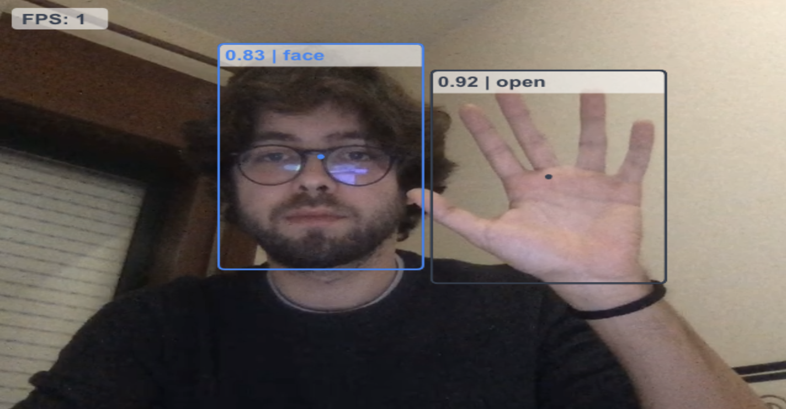
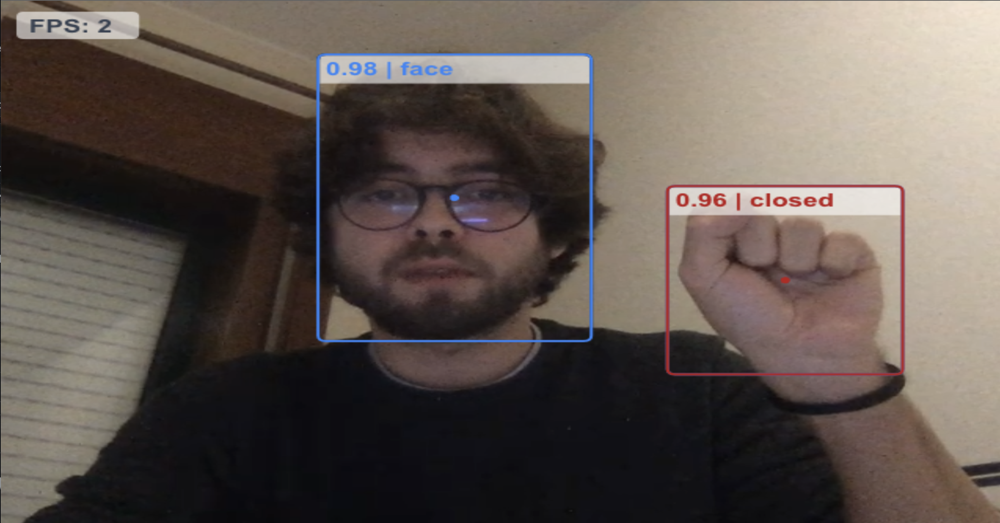

# React HandtrackJS

A very simple and highly commented example of how to use React and HandtrackJs Library to analyze a realtime webcam stream.

## Installation

Clone Repo.

```bash
git clone https://github.com/bernabranco/react-handtrackjs.git
```

Install dependencies.

```bash
npm install
```

## Usage

Start application.

```bash
npm start (runs app on localhost:3000)
```

Open browser on "localhost:3000"

## Features

- Body Recognition (face and hands)
- Hand Recognition (open or closed)
- Realtime webcam stream

## Prints




## License

[MIT](https://choosealicense.com/licenses/mit/)